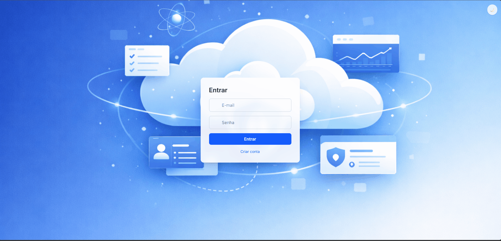

# 🚀 Auth Template SaaS

<p align="center">
  <a href="https://github.com/KayoThyerre">
    
  </a>
  <a href="https://www.linkedin.com/in/kayothyerre/">
    
  </a>
  <a href="https://www.instagram.com/kayoalarcon/?hl=pt_BR">
    
  </a>
</p>

<p align="center">
  
</p>
<p align="center">
  
</p>

<p align="center">
  <b>Template completo de autenticação e painel administrativo para aplicações SaaS modernas.</b>
</p>

<p align="center">
  
  
</p>

---

## 📦 Visão Geral

Este projeto é um **template full-stack reutilizável** criado para acelerar o desenvolvimento de aplicações SaaS, projetos freelance e MVPs.

Ele já entrega uma base completa com autenticação, painel administrativo, gerenciamento de usuários e uma interface moderna com suporte a temas.

A ideia é simples: **você não precisa reinventar o básico toda vez que iniciar um projeto.**

---

## ✨ Funcionalidades

### 🔐 Autenticação

* Registro de usuários com verificação por email
* Login seguro utilizando JWT
* Criptografia de senha com bcrypt
* Alteração de senha

### 👤 Gestão de Usuários

* Controle de acesso por roles (ADMIN / USER)
* Sistema de aprovação de usuários
* Listagem e gerenciamento via painel admin

### 🛠 Painel Administrativo

* Dashboard funcional
* Aprovação e rejeição de usuários
* Gerenciamento de perfil

### 🎨 Interface e Experiência

* Tema Light / Dark com transições suaves
* Background customizado com identidade visual
* Layout moderno com efeito glass (glassmorphism)
* Sidebar com interações e feedback visual
* Totalmente responsivo

---

## 🧱 Tecnologias Utilizadas

### Frontend

* React
* TypeScript
* Vite
* TailwindCSS
* React Router

### Backend

* Node.js
* Express
* Prisma ORM
* PostgreSQL
* JWT Authentication
* bcrypt

---

## 📁 Estrutura do Projeto

```id="l11b9l"
auth-template-clean-v1
│
├── auth-template-api
│   ├── prisma
│   └── src
│       ├── middlewares
│       ├── routes
│       └── server.ts
│
└── auth-template-front
    └── src
        ├── api
        ├── contexts
        ├── hooks
        ├── layouts
        ├── pages
        ├── routes
        └── App.tsx
```

---

## ⚙️ Como rodar o projeto

### 1. Clonar repositório

```bash id="4ng7j9"
git clone https://github.com/KayoThyerre/auth-template-saas.git
```

---

### 2. Backend

```bash id="psq7o6"
cd auth-template-api
npm install
```

Crie um arquivo `.env`:

```env id="6l0qiy"
DATABASE_URL=
JWT_SECRET=
```

Rodar migrations:

```bash id="eicay8"
npx prisma migrate dev
```

Iniciar servidor:

```bash id="ahkw7r"
npm run dev
```

---

### 3. Frontend

```bash id="ow3h8f"
cd auth-template-front
npm install
npm run dev
```

---

## 🌗 Sistema de Temas

* Utiliza Tailwind com `darkMode: "class"`
* Controlado via hook customizado `useTheme`
* Persistência com `localStorage`
* Transições suaves entre Light e Dark

---

## 🔒 Segurança

* Autenticação baseada em JWT
* Senhas criptografadas com bcrypt
* Rate limit para envio de verificação de email
* Rotas protegidas no frontend e backend

---

## 🎯 Casos de Uso

* Templates para SaaS
* Dashboards administrativos
* Sistemas internos
* MVPs rápidos
* Projetos freelance

---

## 🚀 Melhorias Futuras

* Suporte multi-tenant
* Integração com pagamentos (Stripe)
* Logs de auditoria
* Sistema de feature flags

---

## 📄 Licença

MIT License

---

## 👨‍💻 Autor

Desenvolvido por **Kayo Thyerre**

* GitHub: https://github.com/KayoThyerre
* LinkedIn: https://www.linkedin.com/in/kayothyerre/
* Instagram: https://www.instagram.com/kayoalarcon/

---

## 💡 Observação Final

Este template foi pensado para ser uma base sólida, escalável e reutilizável.

Se você está construindo um SaaS, esse projeto te permite pular toda a parte repetitiva e focar diretamente no que realmente importa: **a lógica do seu produto**.
